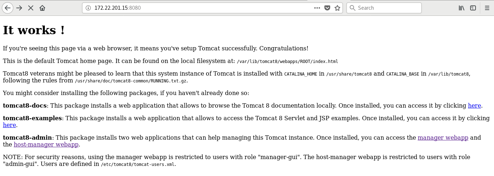

# Introducción a Tomcat 8

En el siguiente documento se explicará como implantar un contenedor de servlets Tomcat versión 8 en un sistema Linux Debian Stretch.

## Instalación

Para instalar tomcat8 desde repositorios:
	
	# apt install tomcat8

Por dependecia va a instalar el paquete `openjdk-8-jre-headless`, que corresponde a una implementación de la JVM mínima para poder ejecuar nuestros programas java.

Desde este momento tendremos Tomcat ejecutandose y sirviendo en el puerto 8080.

Para gestionar el servicio tomcat:

	# systemctl stop|start|restart|status tomcat8

Si estamos instalando tomcat8 en una instancia de OpenStack, y por las limitaciones de las máquinas virtuales en la generación pseudoaleatoria, es necesario modificar el fichero `/usr/lib/jvm/java-7-openjdk-amd64/jre/lib/security/java.security`, y cambiar la siguiente línea:

	securerandom.source=file:/dev/./urandom

Trás el cambio reinciamos el servicio.

## Administración

Esta sección la iniciaremos utilizando una herramienta que nos proporciona la fundación Apache y que nos facilita el despliegue de aplicaciones y manejo del servidor, Tomcat-Manager. Para instalarlo:

	# apt install tomcat8-admin

Una vez instalado debemos crear un usuario con el rol manager para acceder a él. Añadimos una línea similar a la siguiente al fichero `/etc/tomcat6/tomcat-users.xml`:

	<role rolename="manager-gui"/>
	<user username="tomcat" password="s3cret" roles="manager-gui"/>

Para acceder a la zona de administración:

 
Además se instala una aplicación para gestionar los virtual host en tomcat, para acceder a ella, añadimos el siguiente perfil y otro usuario en el fichero anterior:

	<role rolename="admin-gui"/>
	<user username="tomcat" password="s3cret" roles="admin-gui"/>

Y accedemos:

